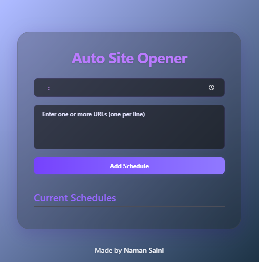

# 🔁 Auto Site Opener – Chrome Extension

A lightweight productivity extension that automatically opens your favorite websites at specific times each day. Perfect for automating your daily routine (like opening LeetCode at 9 AM and YouTube at 1 PM).

 <!-- Add your own screenshot if available -->

---

## ✨ Features

- ⏰ Schedule websites to open at exact times (daily).
- ➕ Add multiple URLs for the same time slot.
- 📋 Clean UI built with Tailwind CSS.
- 🚀 "Open Now" button for instant access.
- 🔄 Persistent storage using `chrome.storage.sync`.

---

## 📦 Installation

1. Clone this repo or [download as ZIP](https://github.com/NamanS4ini/auto-site-opener/releases/download/release/AutoSiteOpener.zip).
2. Open Chrome and go to `chrome://extensions/`.
3. Enable **Developer Mode** (top right).
4. Click **"Load Unpacked"** and select the project folder.
5. Done ✅ — You’ll see the Auto Site Opener icon in your extensions bar.

---

## 🛠️ Usage

1. Click the extension icon to open the popup.
2. Add a time and one or more URLs (one per line).
3. Click **Add Schedule**.
4. The websites will automatically open at the set time every day.
5. Use **"Open Now"** to manually trigger any schedule.

---

## 🧠 How It Works

- On install/startup, the extension sets alarms for each time you add.
- At the scheduled time, it opens the configured URLs in new tabs.
- Schedules repeat **daily** and are stored using `chrome.storage.sync`.

---

## 🖼 Tech Stack

- Manifest V3 (Chrome Extensions)
- JavaScript
- Tailwind CSS
- Chrome APIs:
  - `chrome.alarms`
  - `chrome.storage`
  - `chrome.tabs`

---

## 📁 Folder Structure

```
📦 auto-site-opener/
├── manifest.json
├── popup.html
├── popup.js
├── output.css        # Tailwind compiled CSS
├── input.css         # Tailwind source (optional)
├── background.js
```

---

## 🧪 Coming Soon (Ideas)

- Countdown timer to next launch
- Enable/Disable toggle for schedules
- Export/Import all saved schedules
- Day-of-week filters (e.g. only open on weekdays)

---

## 🙌 Credits

Made by [Me](https://github.com/namans4ini) — feel free to contribute or fork!
